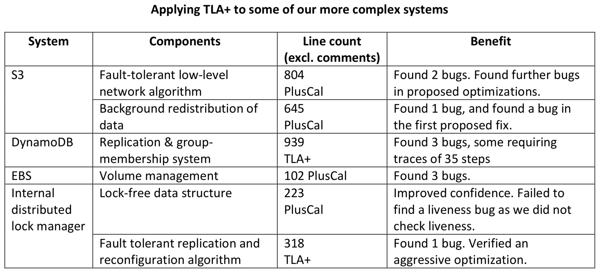

# Часть 0 (Intro)
## Верификация распределенных систем
Распределенные системы хранения и обработки данных -- ключевой компонент современных масштабируемых веб-сервисов.

Например:
* Amazon использует Dynamo для реализации корзины с товарами
* Google использует BigTable в почтовом сервисе Gmail
* LinkedIn использует Kafka для транспорта пользовательских данных

Для таких систем критически важна корректность: из-за ошибки на уровне хранилища пользователь сервиса может потерять свои деньги, сообщения или другие важные данные.

Писать корректный код для распределенных систем невероятно сложно, поскольку необходимо учитывать множество факторов: параллелизм, асинхронность, потерю сообщений, отказы узлов. Поэтому одной из главных проблем для таких систем является *верификация* -- проверка системы на соответствие набору требований (например: система после подтверждения данных не имеет права их потерять).

### Стандартные подходы
В индустрии применяют несколько стандартных методов для верификации распределенных систем:
* Design review -- разработчики описывают компоненты системы и протокол их взаимодействия, чтобы обнаружить возможные ошибки на стадии проектирования, до написания кода
* Тестирование
* Code review -- после прохождения всех рукописных тестов разработчики пытаются найти баги с помощью просмотра нового кода

Но этих методов недостаточно. Причина в том, что человеку трудно промоделировать в уме все возможные выполнения распределенной системы, он легко упустить сложную гонку на дизайн-ревью, код ревью или при составлении теста.

Эту мысль подтверждают инженеры из Amazon [4]: "We use deep design reviews, code reviews, static code analysis, stress testing, fault-injection testing, and many other techniques, but we still find that subtle bugs can hide in complex concurrent fault-tolerant systems. One reason for this problem is that human intuition is poor at estimating the true probability of supposedly ‘extremely rare’ combinations of events in systems operating at a scale of millions of requests per second ..."

Существует рандомизированный подход к тестированию - fault injection. Чтобы покрыть как можно больше нетривиальных исполнений, в код системы или в среду исполнения внедряются сбои (рестарты узлов, задержки или партишены в сети), которые срабатывают в произвольные моменты времени.

Но и этот способ не гарантирует, что будут обнаружены очень редкие сценарии.

Инженеры AWS заключают: "We have found that testing the code is inadequate as a method to find subtle errors in design, as the number of reachable states of the code is astronomical. So we looked for a better approach."

## Формальные методы
Альтернативный подход к верификации ("better approach", про который идет речь выше) – формальные методы.

*Формальная верификация* -- это построение логической модели системы и ее анализ средствами математической логики.

Основные понятия, которыми оперирует формальная верификация:
* *Автомат (State Machine)* –- изменяющееся во времени состояние, которое описывается набором переменных
* *Состояние* автомата -- назначение значений этим переменным
* *Поведение (Behavior)* или *траектория* –- бесконечная последовательность состояний
* *Спецификация (Specification)* или *спека* –- декларативное описание всех поведений системы (состояний и переходов между ними)
* *Свойство (Property)* –- набор допустимых поведений системы, как правило выражается в виде формулы темпоральной логики

Спецификация -- строгий, формальный аналог дизайн-документа.

Задача *проверки модели (model checking)* состоит в исследовании графа состояний системы и проверки указанных свойств.

### TLA+
Одной из самых популярных реализаций такого подхода является разработанный Лесли Лэмпортом язык TLA+ и TLC - model checker для него.

TLA+ -- это язык формальной спецификации, основанную на нетипизированной теории множеств, логике первого порядка и временной логике, которую Лэмпорт назвал *TLA (Temporal Logic of Actions)*.

Типичная спецификация для формальной верификации на TLA+ выглядит так: Spec == Init /\ []Next.

Где:
* Init -- предикат, задающий множество начальных состояний системы
* Next -- предикат на парах состояний (*действие*, action)
* [] -- темпоральный оператор, означающий "всегда"

Свойства в TLA+ задаются формулами *LTL* - темпоральной логики линейного времени.

Примеры:

Starvation Freedom -- мьютекс гарантирует, что каждый поток бесконечно часто попадает в критическую секцию.

    StarvationFreedom == \A t \in Thread: []<>(pc[t] = "CS")

Eventual Consistency -- все реплики в конечном итоге сойдутся к одному состоянию

    EventualConsistency == <>[] (\A i, j \in Regions : Database[i] = Database[j])

Хорошее введение в TLA+ -- книга Practical TLA и видеокурс Лесли Лампорта. А хороший подробный справочник -- Specifying Systems.

### Моделирование распределенных систем
В работе мы будем использовать TLA+ для спецификации и верификации распределенных систем.

Сам по себе TLA+ никак не привязан к распределенности, не оперирует понятиями этой предметной области. Это логический "ассемблер", на котором можно описать произвольные системы. Но Лэмпорт намеренно выстраивал его таким образом, чтобы на него удобно укладывались асинхронность и конкурентность.

Общая схема представления распределенной системы в TLA+:
* Вершины в графе состояний отвечают “моментальному снимку” всей системы, они образованы состоянием всех реплик в системе и состоянием сети.
* Переходы между состояниями соответствуют реакции узлов на события: доставку сообщения от другого узла, запрос или операция от клиента, и т.д.

## TLA+ в индустрии
TLA+ был разработан Лесли Лэмпортом в 1999 году как инструмент для спецификации собственных алгоритмов, и использовался только лишь в академических кругах.

Интерес со стороны индустрии начался со статьи “Use of Formal Methods at Amazon Web Services”, в которой инженеры AWS поделились своим опытом формальной верификации критически важных для облачной инфраструктуры алгоритмов: лпртоколов репликации и переконфигурации, лок-фри алгоритмов, сетевых протоколов.

Сейчас все больше крупных IT компаний используют TLA+ для верификации своих сервисов:
* В Microsoft с помощью TLA+ разработчики облачной платформы Microsoft Azure специфицировали модели согласованности распределенной базы данных CosmosDB
* В Yandex с помощью TLA+ был воспроизведен сложный сценарий A-B-A из нескольких десятков шагов в lock-free аллокаторе памяти и верифицирован патч для этого сценария.
* В Elastic - c помощью TLA+ верифицировали алгоритм составления индекса по документам и протокол репликации данных.

## ClickHouse
ClickHouse (Кликхаус, КХ) -- столбцовая система управления базами данных (СУБД) для онлайн обработки аналитических запросов (OLAP). Разрабатывается компанией Яндекс и open-source сообществом.

Таблицы в ClickHouse горизонтально масштабируются с помощью шардирования, а отказоустойчивость обеспечивается с помощью репликации каждого из шардов.

## Цели работы
Основная задача состоит в выделении общих приемов для описания распределенных систем и модели, в которой они работают:
* Исследовать существующие спецификации TLA+ для распределенных алгоритмов и промышленных распределенных систем.
* Выделить общие приемы моделирования распредленных систем (моделирование участиков / компонентов, сети, сбоев, работа с TLC),
* Применить эти приемы для формального описании алгоритма репликации и верификации алгроитмов обрезки лога и кворумных записей в Кликхаус.

## Спецификации для исследования
В работе будут исследованы спецификации для следующих алгоритмов и систем:
* Протокол репликации партиции в распределенной персистентной очереди сообщений Apache Kafka
* Snapshot Isolation -- алгоритм изоляции транзакций, работающий поверх мультиверсионного хранилища данных.
* Percolator -- клиентский протокол распределенных транзакций поверх распределенного key/value хранилища BigTable, используется в Google.
* Single Decree Paxos -- протокол распределенного консенсуса, который лежит в основе механизма репликации шардов (таблетов) в системе Google Spanner.
* Raft -- протокол репликации лога команд, современный аналог Paxos. Применяется в MongoDB, InfluxDB и etcd

## План работы
В главе 1 будут описаны принципы спецификации распределенных систем с помощью TLA+:
* Как выбрать нужный уровень детализации для системы/алгоритма
* Надо ли моделировать сбои в спеках
* Как моделировать сеть в алгоритмах, где используется взаимодействие через отправку сообщений между узлами
* Каким образом TLA+ позволяет описать недетерминизм, который возникает в системе.

В главе 2 пойдет речь об инженерных аспектах формальной верификации:
* Как протестировать саму спецификацию
* Как сократить число состояний в графе конфигураций
* Какие выбрать подходящий режим у model checker-а.

В главе 3 мы применим все разработанные приему для формальной спецификации и верификации протокола репликации в распределенной аналитической базе данных ClickHouse.
